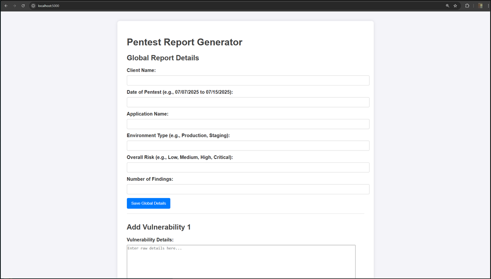
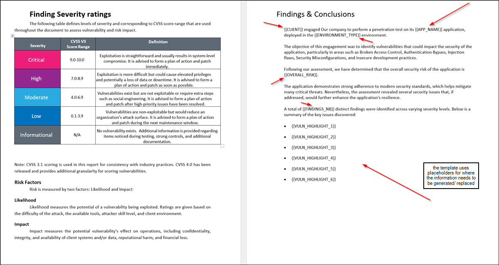
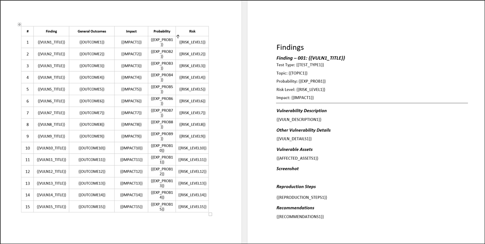
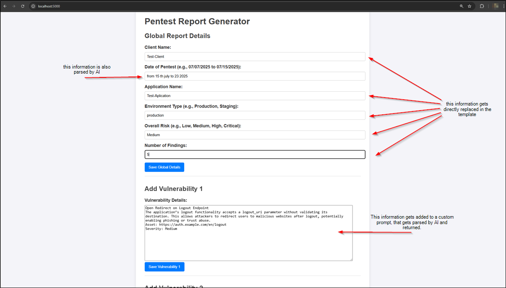
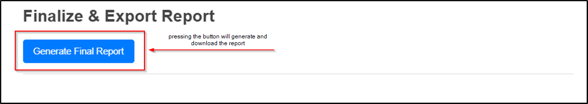
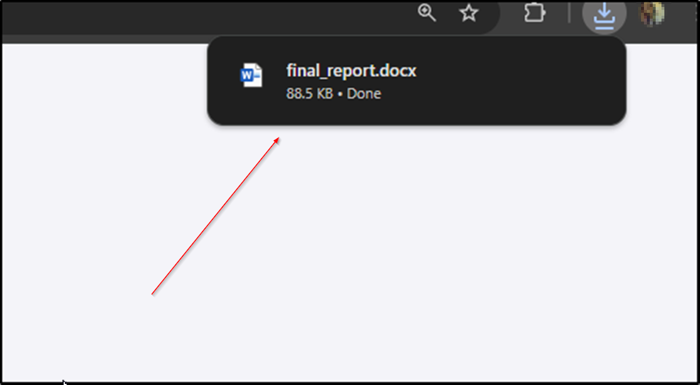
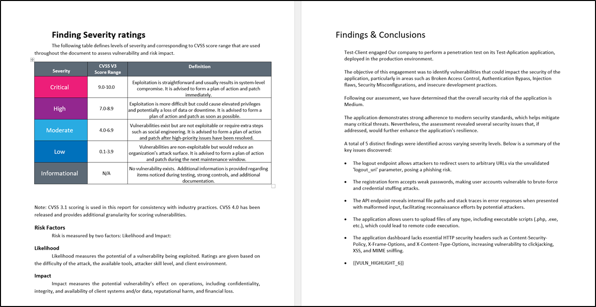
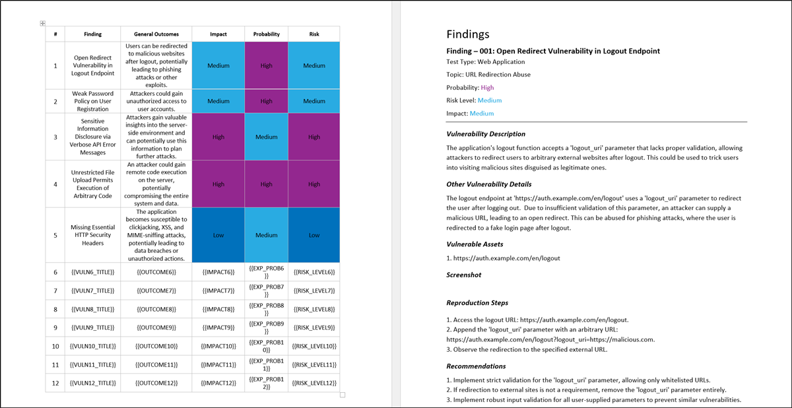

# AI-Reporting-Tool-Showcase
Showcase of an AI-powered penetration testing report automation tool. No code included — only feature highlights and demo.

### This project demonstrates a local application built to automate penetration testing report generation using AI, dramatically reducing manual reporting effort and ensuring consistency with professional formatting.

# Key Benefits

### ⏳ Report generation time cut from 4–5 hours to 20–30 minutes

### ⚖️ Precise placeholder-based formatting in .docx (e.g., {{CLIENT}}, {{RISK_LEVEL}})

### 🏛 Prompt-based vulnerability generation tuned for high-quality structure and clarity

### 🌐 Supports both Gemini and local LLMs (e.g., Mistral)

### 🌎 Compatible with any .docx template using placeholders

# What It Does

###  - Collects raw vulnerability descriptions and metadata from a local form interface

###  - Sends the input to an AI model using a custom, template-aware prompt

###  - Fills a .docx template using the response, preserving all placeholder formatting

###  - Generates a full penetration test report with reproduction steps, severity levels, and recommendations

# Notes on Usage

### The AI-generated content respects formatting like bolded headers, lists, and color-coded risk levels

### Vulnerabilities are not auto-sorted; user must enter them in desired order (e.g., Critical → Info)

### A single report typically uses 8,000–10,000 tokens, costing around $0.03–$0.04 per report with Gemini Pro 1.5

### The current UI supports screenshot upload placeholders, with planned upgrades to embed those images automatically

### Prompts are adaptable to any new template structure, as long as placeholder labels are consistent (or adjusted in the config)

# 📁 Screenshot Highlights

| Application Interface | Template Preview (1) | Template Preview (2) |
|------------------------|----------------------|------------------------|
|  |  |  |

| Input Form | Generate Report | Report Downloaded |
|------------|------------------|--------------------|
|  |  |  |

| Final Report (1) | Final Report (2) |
|------------------|------------------|
|  |  |

*All screenshots are available in the `/screenshots/` folder.*

# Technical Stack

- Python (Flask backend)

- python-docx for .docx manipulation

- Gemini 1.5 Pro (via API) or local Mistral model

- HTML/Jinja templates for structured input

# 🔒 Disclaimer

### This repository is for demonstration purposes only.The full source code and internal logic are private and not publicly shared.For collaboration inquiries, contact the developer directly.

